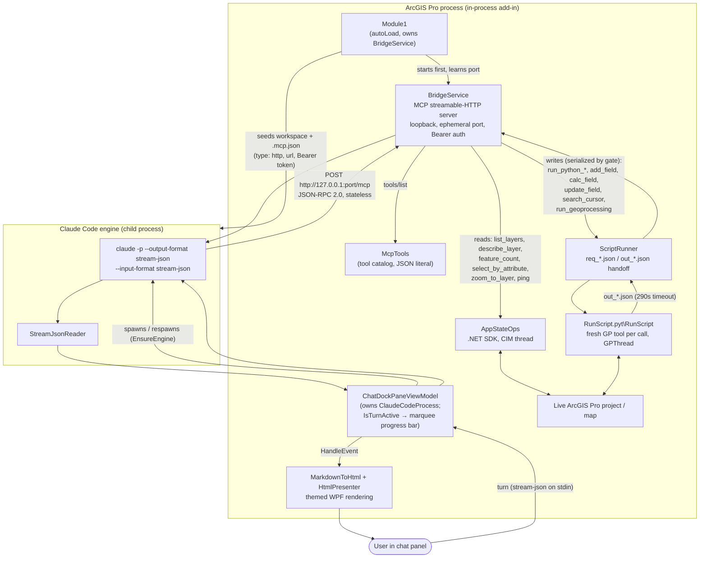
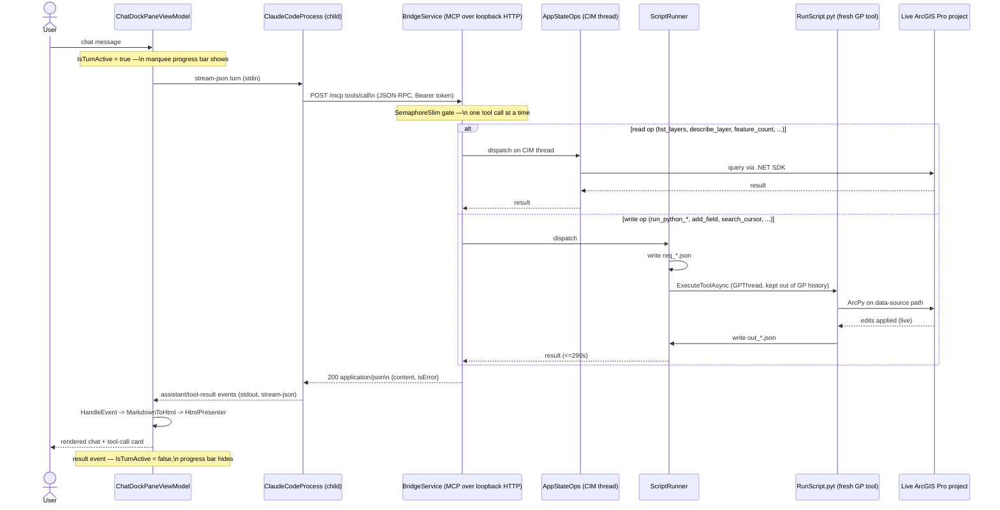

# Architecture Diagrams

Companion to `CLAUDE.md`. Two views: static components/processes, and the
runtime sequence of one live-project tool call.

## Components & processes

## One live-project tool call (sequence)

## Notes

- Serial dispatch: a `SemaphoreSlim(1,1)` gate around `tools/call` guarantees one tool call — and therefore one GP run — at a time. `initialize`/`tools/list`/`ping` answer outside the gate.
- The bridge is stateless: each request is one `POST /mcp` + one JSON response, no SSE stream, no session id. The engine's HTTP MCP client reconnects with backoff on its own.
- The port is ephemeral (OS-chosen) and written with the Bearer token into `.mcp.json` every session.
- `RunScript.pyt` runs as a **fresh** foreground GP tool per write call — no long-lived ArcPy daemon, avoiding the staleness of `arcpy.mp.ArcGISProject("CURRENT")`.
- Work-in-progress: a thin indeterminate `ProgressBar` (marquee) under the status bar, bound to `IsTurnActive` — set on send, cleared on the `result` event, Stop, or engine exit.
